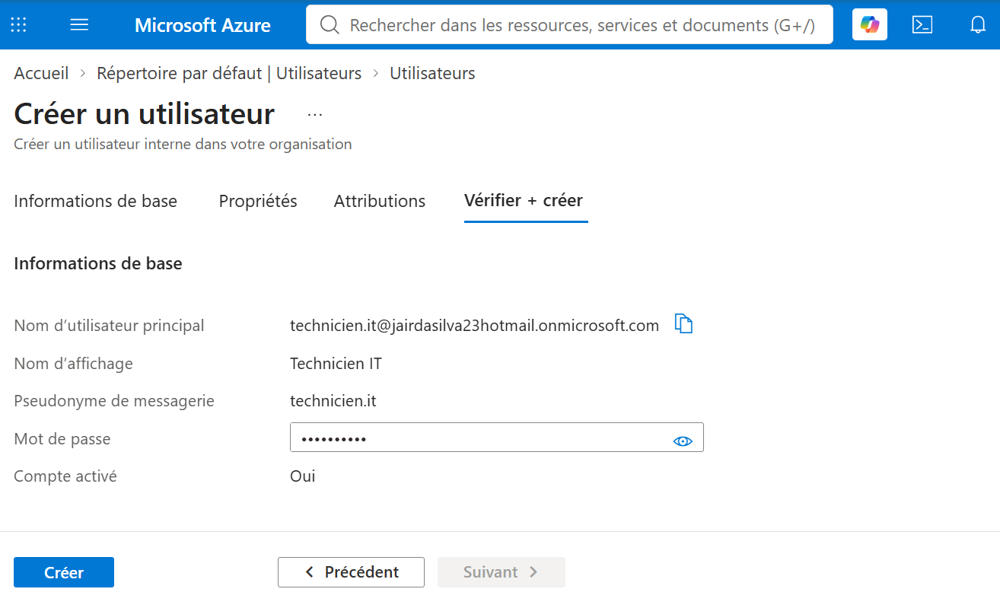
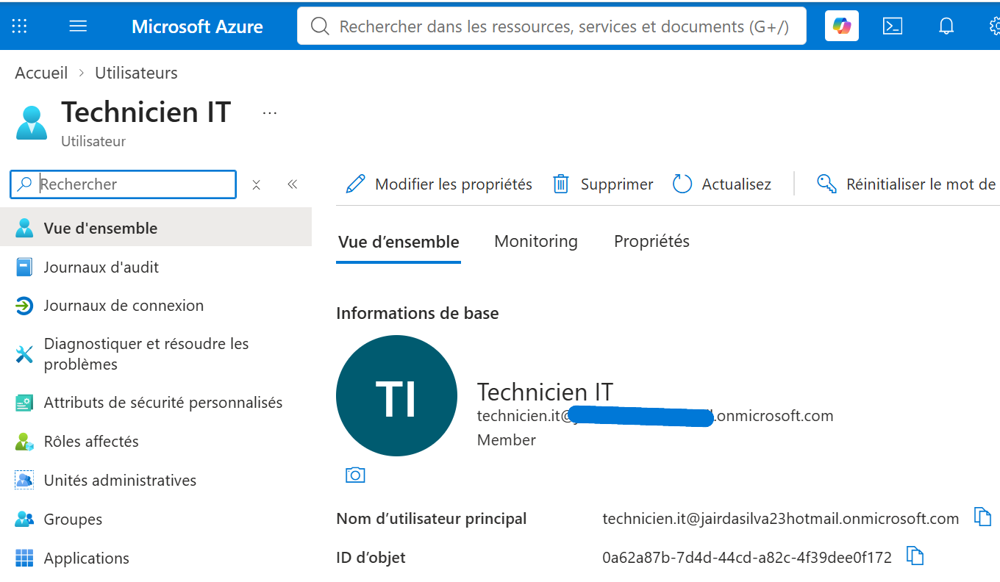
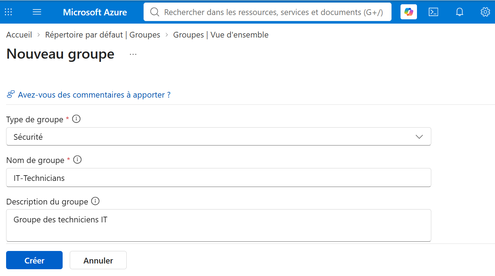
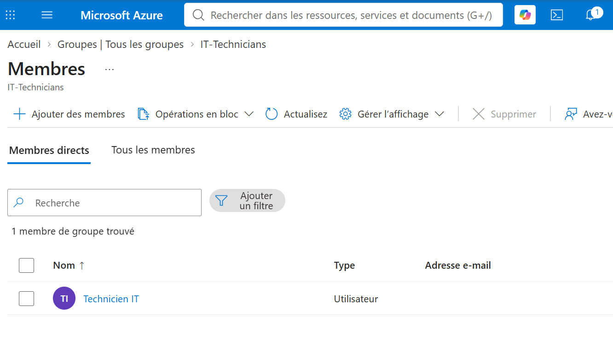
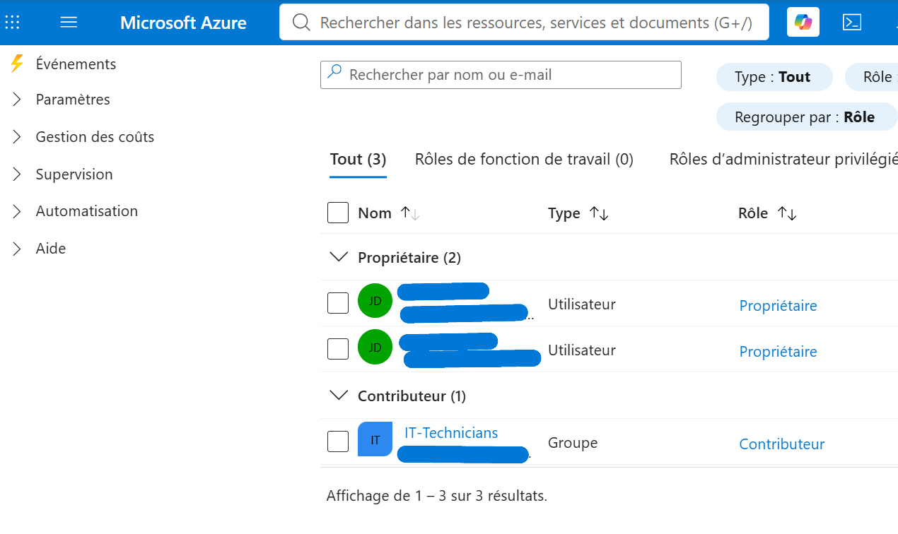
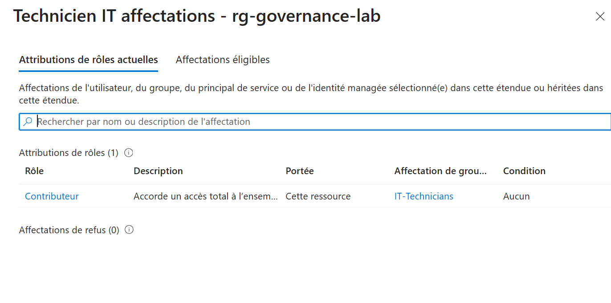
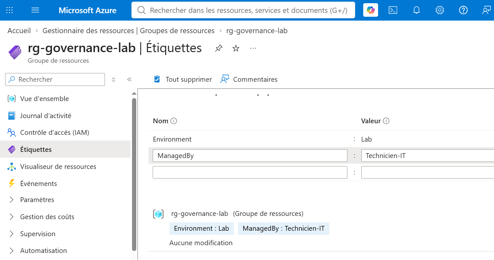
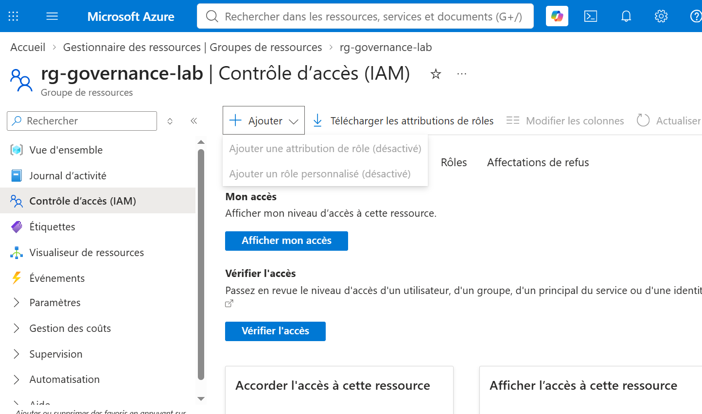

# Microsoft Entra ID et Azure RBAC (IAM)

## 🎯 Objectif

Déployer et tester une gestion des identités et des autorisations dans Microsoft Azure à l'aide de **Microsoft Entra ID** et **Azure Role-Based Access Control (RBAC)**.

L'objectif de ce laboratoire est de simuler l'arrivée d'un technicien IT dans une entreprise :

- création d'un utilisateur dans Microsoft Entra ID ;
- création d'un groupe de sécurité ;
- ajout de l'utilisateur au groupe ;
- attribution du rôle **Contributeur** au groupe sur un Resource Group ;
- vérification des permissions héritées par l'utilisateur ;
- test pratique des droits accordés ;
- vérification des limitations du rôle Contributeur ;
- révocation de l'accès.

Ce projet a été réalisé dans le cadre de ma préparation à la certification **Microsoft Azure AZ-104** afin de développer mes compétences en gestion des identités, contrôle des accès et administration des autorisations Azure.

---

## 💻 Technologies utilisées

- Microsoft Azure
- Microsoft Entra ID
- Azure Role-Based Access Control (RBAC)
- Azure Identity and Access Management (IAM)
- Azure Resource Groups
- Microsoft Entra Users
- Microsoft Entra Security Groups
- Azure Built-in Roles
- Azure Portal

---

## 🏗️ Architecture

```text
                  Microsoft Entra ID
                         │
                         ▼
                 Utilisateur Entra
                   Technicien IT
                         │
                    membre de
                         │
                         ▼
                 IT-Technicians
                Groupe de sécurité
                         │
                         │ Azure RBAC
                         ▼
                Rôle Contributeur
                         │
                         ▼
                rg-governance-lab
                  Resource Group
```

Le rôle **Contributeur** est attribué au groupe `IT-Technicians` et non directement à l'utilisateur.

L'utilisateur `Technicien IT` obtient donc ses permissions Azure grâce à son appartenance au groupe.

---

## 🎯 Résultat

Le laboratoire a permis de valider le fonctionnement de Microsoft Entra ID et d'Azure RBAC.

Les tests réalisés ont confirmé que :

- l'utilisateur `Technicien IT` peut être géré dans Microsoft Entra ID ;
- l'utilisateur appartient au groupe de sécurité `IT-Technicians` ;
- le rôle **Contributeur** est attribué au groupe au niveau du Resource Group `rg-governance-lab` ;
- l'utilisateur hérite du rôle Contributeur grâce à son appartenance au groupe ;
- l'utilisateur peut modifier les ressources auxquelles il a accès ;
- le rôle Contributeur ne permet pas de gérer les attributions de rôles RBAC ;
- la suppression de l'attribution RBAC révoque l'accès obtenu par l'intermédiaire du groupe.

Ce laboratoire démontre ainsi la séparation entre **gestion des identités** avec Microsoft Entra ID et **gestion des autorisations sur les ressources Azure** avec Azure RBAC.

---

## 👤 Auteur

**Jair Da Silva**

Technicien Systèmes & Réseaux | Support IT N1/N2 | Microsoft Azure

GitHub : https://github.com/jairdasilva-it

LinkedIn : https://www.linkedin.com/in/jair-da-silva-6b14aa278

---

# 🚀 Étapes du projet

## 1️⃣ Création de l'utilisateur Microsoft Entra ID

Création d'un nouvel utilisateur destiné à représenter un technicien informatique dans l'environnement Azure.

Utilisateur créé :

```text
Technicien IT
```

L'utilisateur est créé dans Microsoft Entra ID et activé dans le tenant.

---

## 2️⃣ Création du groupe de sécurité

Création d'un groupe Microsoft Entra ID :

```text
IT-Technicians
```

Type :

```text
Sécurité
```

Le groupe permet de gérer les autorisations de plusieurs utilisateurs de manière centralisée plutôt que d'attribuer individuellement les permissions.

---

## 3️⃣ Ajout de l'utilisateur au groupe

L'utilisateur :

```text
Technicien IT
```

est ajouté comme membre du groupe :

```text
IT-Technicians
```

Les autorisations pourront ainsi être attribuées au groupe puis héritées par ses membres.

---

## 4️⃣ Attribution du rôle Azure RBAC

Dans le Resource Group :

```text
rg-governance-lab
```

le rôle Azure intégré :

```text
Contributeur
```

est attribué au groupe :

```text
IT-Technicians
```

L'attribution est réalisée au niveau du Resource Group afin de limiter la portée des permissions à cette ressource.

---

## 5️⃣ Vérification de l'accès

La fonction **Vérifier l'accès** d'Azure IAM permet de contrôler les permissions effectives de l'utilisateur `Technicien IT`.

Azure confirme que l'utilisateur possède le rôle :

```text
Contributeur
```

via le groupe :

```text
IT-Technicians
```

Cette vérification démontre que les permissions RBAC sont correctement héritées par l'intermédiaire du groupe Microsoft Entra ID.

---

## 6️⃣ Test pratique des permissions

Une session distincte est ouverte avec le compte `Technicien IT`.

L'utilisateur accède au Resource Group :

```text
rg-governance-lab
```

Une nouvelle étiquette est ajoutée :

```text
ManagedBy : Technicien-IT
```

La modification est enregistrée avec succès.

Ce test confirme que le rôle Contributeur permet réellement à l'utilisateur de modifier les ressources comprises dans le périmètre de son attribution RBAC.

---

## 7️⃣ Vérification des limites du rôle Contributeur

Depuis la session `Technicien IT`, la section **Contrôle d'accès (IAM)** du Resource Group est consultée.

Les fonctions permettant notamment d'ajouter une attribution de rôle sont désactivées.

Cela démontre qu'un utilisateur disposant du rôle **Contributeur** peut gérer les ressources auxquelles il a accès sans pour autant pouvoir attribuer des rôles RBAC à d'autres identités.

---

## 8️⃣ Révocation de l'accès

L'attribution du rôle Contributeur au groupe `IT-Technicians` est supprimée.

Après révocation, l'utilisateur `Technicien IT` ne dispose plus de l'accès au Resource Group obtenu précédemment grâce à son appartenance au groupe.

Cette dernière étape permet de valider le cycle complet de gestion d'un accès RBAC :

```text
Création de l'identité
        │
        ▼
Ajout au groupe
        │
        ▼
Attribution RBAC
        │
        ▼
Héritage des permissions
        │
        ▼
Validation des droits
        │
        ▼
Révocation de l'accès
```

---

# 📸 Captures d'écran

## 1. Création de l'utilisateur Microsoft Entra ID

Configuration du nouvel utilisateur `Technicien IT`.



---

## 2. Vue d'ensemble de l'utilisateur

Vérification de la création de l'utilisateur dans Microsoft Entra ID.



---

## 3. Création du groupe de sécurité

Configuration du groupe `IT-Technicians`.



---

## 4. Vérification des membres du groupe

L'utilisateur `Technicien IT` apparaît comme membre du groupe de sécurité `IT-Technicians`.



---

## 5. Attribution du rôle Contributeur

Attribution du rôle Azure RBAC **Contributeur** au groupe `IT-Technicians` sur le Resource Group `rg-governance-lab`.



---

## 6. Vérification des permissions héritées

Azure confirme que l'utilisateur `Technicien IT` dispose du rôle Contributeur par l'intermédiaire du groupe `IT-Technicians`.



---

## 7. Test pratique des droits Contributeur

L'utilisateur `Technicien IT` modifie le Resource Group en ajoutant l'étiquette `ManagedBy : Technicien-IT`.



---

## 8. Vérification des limites du rôle Contributeur

La gestion des attributions de rôles n'est pas disponible pour l'utilisateur disposant uniquement du rôle Contributeur.



---

# 🔐 Principe de sécurité appliqué

Ce laboratoire applique une méthode de gestion des accès basée sur les groupes.

Au lieu d'attribuer directement le rôle à chaque utilisateur :

```text
Utilisateur → Rôle → Ressource
```

le rôle est attribué à un groupe :

```text
Utilisateur
     │
     ▼
Groupe de sécurité
     │
     ▼
Azure RBAC
     │
     ▼
Ressource Azure
```

Cette approche facilite l'administration des autorisations : les utilisateurs peuvent être ajoutés ou retirés du groupe sans devoir recréer individuellement les attributions de rôles sur les ressources Azure.

---

# ✅ Validation

Les éléments suivants ont été testés et validés :

- création d'un utilisateur Microsoft Entra ID ;
- création d'un groupe de sécurité Microsoft Entra ID ;
- gestion de l'appartenance au groupe ;
- attribution d'un rôle Azure RBAC ;
- utilisation du rôle intégré Contributeur ;
- attribution du rôle à l'échelle d'un Resource Group ;
- héritage des permissions par l'intermédiaire d'un groupe ;
- vérification des permissions effectives avec Azure IAM ;
- connexion avec un compte utilisateur distinct ;
- modification d'une ressource avec le rôle Contributeur ;
- vérification des limites du rôle Contributeur ;
- révocation d'une attribution de rôle ;
- validation de la perte d'accès après révocation.

---

# 📚 Ce que j'ai appris

Ce projet m'a permis d'apprendre à :

- créer et administrer des utilisateurs Microsoft Entra ID ;
- créer et administrer des groupes de sécurité ;
- gérer l'appartenance des utilisateurs aux groupes ;
- comprendre la différence entre identité et autorisation ;
- utiliser Azure Role-Based Access Control (RBAC) ;
- attribuer un rôle Azure à un groupe ;
- définir la portée d'une attribution RBAC ;
- vérifier les permissions effectives d'un utilisateur ;
- comprendre l'héritage des permissions par groupe ;
- comprendre les capacités et les limites du rôle Contributeur ;
- tester les autorisations avec un compte utilisateur distinct ;
- révoquer une attribution RBAC ;
- appliquer une gestion centralisée des permissions.

---

# 💼 Compétences démontrées

- Administration de Microsoft Entra ID
- Gestion des utilisateurs Microsoft Entra ID
- Gestion des groupes de sécurité
- Gestion des appartenances aux groupes
- Azure Role-Based Access Control (RBAC)
- Azure Identity and Access Management (IAM)
- Attribution de rôles Azure
- Gestion des rôles Azure intégrés
- Gestion des scopes RBAC
- Vérification des permissions effectives
- Gestion des accès basée sur les groupes
- Administration des Azure Resource Groups
- Application du principe de moindre privilège
- Test et validation des autorisations
- Révocation des accès
- Administration des identités et des accès Microsoft Azure
- Préparation à la certification Microsoft Azure AZ-104